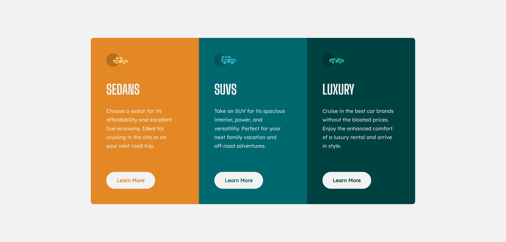

# Frontend Mentor - 3-column preview card component solution

This is a solution to the [3-column preview card component challenge on Frontend Mentor](https://www.frontendmentor.io/challenges/3column-preview-card-component-pH92eAR2-). Frontend Mentor challenges help you improve your coding skills by building realistic projects. 

## Table of contents

- [Frontend Mentor - 3-column preview card component solution](#frontend-mentor---3-column-preview-card-component-solution)
  - [Table of contents](#table-of-contents)
  - [Overview](#overview)
    - [The challenge](#the-challenge)
    - [Screenshot](#screenshot)
    - [Links](#links)
  - [My process](#my-process)
    - [Built with](#built-with)
    - [What I learned](#what-i-learned)
  - [Author](#author)

## Overview

### The challenge

Users should be able to:

- View the optimal layout depending on their device's screen size
- See hover states for interactive elements

### Screenshot



### Links

- Solution URL: [https://github.com/ShrutiShinde418/FrontendMentor4/tree/main/3-column-preview-card](https://github.com/ShrutiShinde418/FrontendMentor4/tree/main/3-column-preview-card)
- Live Site URL: [https://3-column-preview-card-ten-sigma.vercel.app/](https://3-column-preview-card-ten-sigma.vercel.app/)

## My process

### Built with

- Semantic HTML5
- SASS

### What I learned

- SASS
- Interpolation and map-get() in SASS

```scss
@each $index, $primary-color in $cards {
    .card-#{$index} {
      background-color: $primary-color;
      padding: 2.85rem 0 2.85rem 2.85rem;
      border-radius: map-get($border-radii, $index);
      button {
        @include cardButton($primary-color);
      }
    }
  }
```

## Author

- Frontend Mentor - [@ShrutiShinde418](https://www.frontendmentor.io/profile/ShrutiShinde418)

