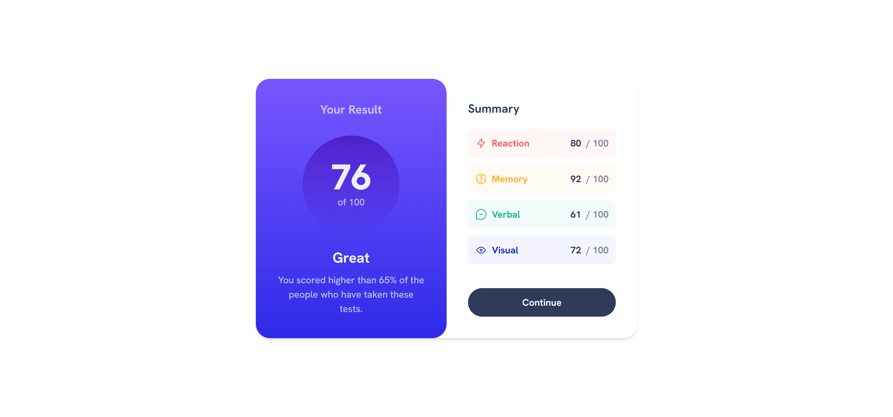

# Frontend Mentor - Results summary component solution

This is a solution to the [Results summary component challenge on Frontend Mentor](https://www.frontendmentor.io/challenges/results-summary-component-CE_K6s0maV). Frontend Mentor challenges help you improve your coding skills by building realistic projects. 

## Table of contents

- [Frontend Mentor - Results summary component solution](#frontend-mentor---results-summary-component-solution)
  - [Table of contents](#table-of-contents)
  - [Overview](#overview)
    - [The challenge](#the-challenge)
    - [Screenshot](#screenshot)
    - [Links](#links)
  - [My process](#my-process)
    - [Built with](#built-with)
    - [What I learned](#what-i-learned)
  - [Author](#author)

## Overview

### The challenge

Users should be able to:

- View the optimal layout for the interface depending on their device's screen size
- See hover and focus states for all interactive elements on the page

### Screenshot

### Links

- Solution URL: [https://github.com/ShrutiShinde418/FrontendMentor4/tree/main/results-summary-component](https://github.com/ShrutiShinde418/FrontendMentor4/tree/main/results-summary-component)
- Live Site URL: [https://results-summary-component-hhfx4rvm9-shrutishinde418.vercel.app/](https://results-summary-component-hhfx4rvm9-shrutishinde418.vercel.app/)

## My process

### Built with

- Tailwind CSS

### What I learned

- Tailwind CSS
- Fetch API

## Author

- Frontend Mentor - [@ShrutiShinde418](https://www.frontendmentor.io/profile/ShrutiShinde418)

